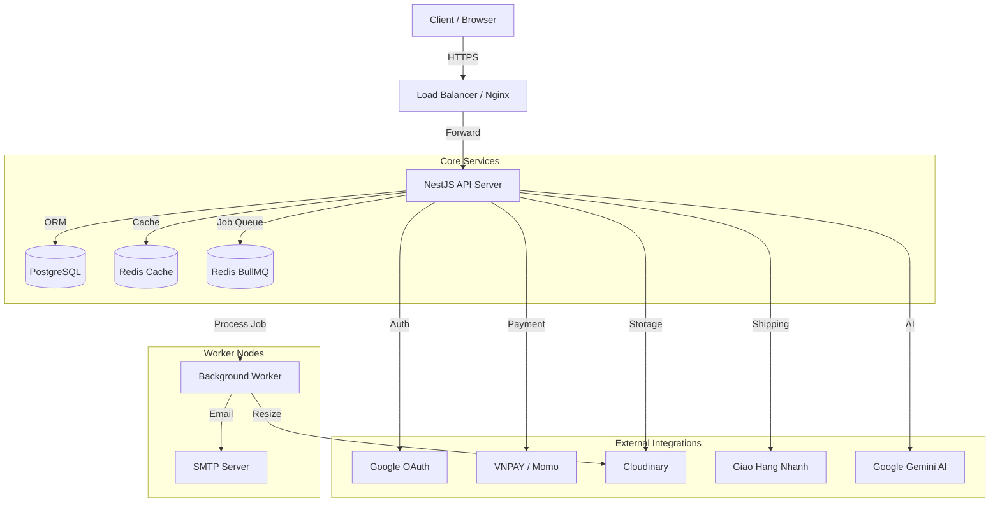
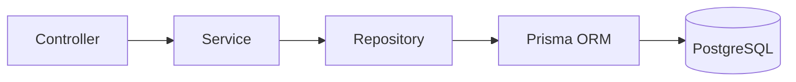

# System Architecture

> **Architecture Style:** Modular Monolith
> **Runtime:** Node.js (NestJS Framework)
> **Data Layer:** PostgreSQL (Prisma ORM), Redis (Cache & Queue)

## 1. High-Level Overview (Mermaid)

## 2. Key Components

### A. Modular Monolith Standard

Hệ thống được chia thành các Feature Modules độc lập (`src/modules/*`), kết nối với nhau thông qua `Service Layer` hoặc `Event Bus` (nếu cần decouple).

- **Core Module (`@core/*`):** Chứa các logic dùng chung cho toàn bộ dự án như `Prisma`, `Redis`, `Interceptor`, `Filter`, `Guard`. Module này không phụ thuộc vào bất kỳ Feature Module nào.
- **Feature Modules (`src/*`):** `Auth`, `Users`, `Products`, `Orders`. Mỗi module chứa Controller, Service, và DTO riêng.
- **Integration Modules (`@integrations/*`):** Adapter để giao tiếp với bên thứ 3 (Cloudinary, SendGrid, AI).

### B. Data Flow Strategy

1.  **Request Handling:**
    `Request` -> `Middleware` (Rate Limit, Helmet) -> `Guard` (Auth) -> `Interceptor` (Transform/Cache) -> `Pipe` (Validation) -> `Controller`.
2.  **Business Logic:**
    `Controller` -> `Service` -> `Repository` -> `Prisma` -> `Database`.
3.  **Cross-Cutting Concerns:**
    `Exception Filter` (Error Handling), `Auditing` (Save change history), `Logging` (Structured Logs).

### C. Async Processing (Background Jobs)

Các tác vụ nặng được đẩy xuống `BullMQ`:

- Sending Emails (Welcome, OTP, Order Confirmation).
- Image Processing (Resize, Optimize).
- Report Generation.

## 3. Environment & Configuration

Hệ thống sử dụng `ConfigModule` với `Joi Validation` để đảm bảo biến môi trường hợp lệ.

| Category        | Key Variables                               | Description                           |
| :-------------- | :------------------------------------------ | :------------------------------------ |
| **System**      | `NODE_ENV`, `PORT`                          | Environment mode (dev/prod) and port. |
| **Database**    | `DATABASE_URL`                              | PostgreSQL Connection String.         |
| **Cache**       | `REDIS_URL`                                 | Redis for Cache & Queue.              |
| **Auth**        | `JWT_ACCESS_SECRET`, `JWT_REFRESH_SECRET`   | Keys for signing Tokens.              |
| **Third Party** | `GEMINI_API_KEY`, `CLOUDINARY_*`, `VNPAY_*` | API Keys for external services.       |

## 4. Multi-Tenancy Strategy (WIP)

- **Model:** Discriminator Column (`tenantId` trong mỗi bảng quan trọng).
- **Tenant Context:** `TenantMiddleware` sẽ parse `x-tenant-id` header và inject vào Request Context để Prisma tự động filter dữ liệu (Row Level Security - Application Level).
