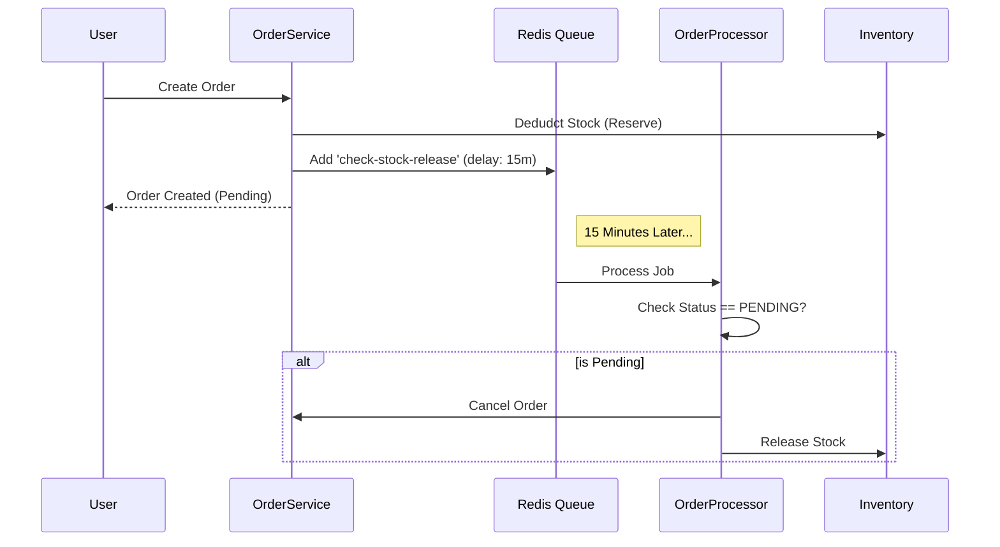

# API Architecture Documentation

> **Status**: Living Document
> **Technique**: Modular Monolith, Clean Architecture, Multi-tenancy (Schema-base)
> **Stack**: NestJS, Prisma, PostgreSQL (pgvector), Redis (BullMQ)

---

## 1. High-Level Overview

Hệ thống được thiết kế theo kiến trúc **Modular Monolith**, trong đó các module nghiệp vụ (Modules) được tách biệt rõ ràng nhưng chạy trên cùng một Runtime để tối ưu hóa việc phát triển và triển khai ban đầu. Hệ thống hỗ trợ **Multi-tenancy** ngay từ lõi (Core), đảm bảo dữ liệu các cửa hàng (Tenant) được cô lập hoàn toàn về mặt logic (Logical Isolation).

### Architectural Goals

1.  **Multi-tenancy by Default**: Mọi truy vấn dữ liệu **PHẢI** tự động filter theo `tenantId`. Developer không cần nhớ thêm `where: { tenantId }` thủ công.
2.  **Strict Boundary**: Các module (Sales, Catalog, Identity) giao tiếp qua Public API (Service/Event), không import trực tiếp Database Model của nhau nếu có thể tránh.
3.  **Security First**: Zero Trust trong Authentication, Input Validation (Zod), và Output Serialization.
4.  **Async Priority**: Các tác vụ nặng (G gửi mail, report, stock release) được đẩy xuống background queue (BullMQ).

---

## 2. System Layer Diagram

Kiến trúc phân tầng (Layered Architecture) đảm bảo Separation of Concerns:

```mermaid
graph TD
    Client[Client (Web/Mobile)] -->|HTTPS/JSON| Gateway[API Gateway / Nginx]
    Gateway -->|Request| MainApp[NestJS Application]

    subgraph "Presentation Layer"
        Middleware[Middlewares (Tenant, Logger, Helmet)]
        Guard[Guards (Auth, Permission, Throttler)]
        Pipe[Pipes (Zod Validation, Transformation)]
        Controller[Controllers (Routing, DTO)]
    end

    subgraph "Application Layer (Modules)"
        Auth[Identity Module]
        Catalog[Catalog Module]
        Sales[Sales Module]
        Worker[Processor / Queue Consumer]
    end

    subgraph "Domain & Infra Layer (Core)"
        Service[Services (Business Logic)]
        Repo[Base Repository (Data Access)]
        Prisma[Prisma Client (ORM)]
        Redis[Redis Cache / Queue]
    end

    MainApp --> Middleware
    Middleware --> Guard
    Guard --> Pipe
    Pipe --> Controller
    Controller --> Service
    Service --> Repo
    Service -->|Event/Job| Redis
    Redis -->|Consume| Worker
    Repo --> Prisma
    Prisma --> DB[(PostgreSQL)]
```

---

## 3. Directory Structure

Cấu trúc thư mục phản ánh tư duy Module hóa. `Core` chứa hạ tầng dùng chung, các folder khác là Feature Modules.

```text
api/src/
├── app.module.ts              # Root Module (Orchestrator)
├── main.ts                    # Entry point (Bootstrap)
├── core/                      # 🛡️ INFRASTRUCTURE LAYER (Shared)
│   ├── tenancy/               # Multi-tenancy Logic (Middleware, Context)
│   ├── repository/            # Base Repository Pattern
│   ├── security/              # Auth Guards, Strategies (JWT)
│   ├── prisma/                # DB Connection & Extensions
│   ├── redis/                 # Redis Client
│   ├── middlewares/           # Global Middlewares (Logging, CorrelationID)
│   ├── interceptors/          # Response Transform (StandardResponse)
│   └── filters/               # Global Exception Filters
│
├── identity/                  # 👤 IDENTITY DOMAIN
│   ├── auth/                  # Login, Register, 2FA, Token Management
│   ├── users/                 # User Profile, CRUD
│   ├── roles/                 # RBAC Implementation (Role, Permission)
│   └── tenants/               # Tenant Management (Admin only)
│
├── catalog/                   # 📦 CATALOG DOMAIN
│   ├── products/              # Product Management
│   ├── skus/                  # Inventory Items (Variants)
│   ├── categories/            # Taxonomies
│   └── brands/                # Brand Management
│
├── sales/                     # 💰 SALES DOMAIN
│   ├── orders/                # Order Placement, Status Flow, Background Jobs
│   ├── cart/                  # Shopping Cart (In-DB persistent)
│   ├── payment/               # Payment Gateway Integration
│   └── invoices/              # Billing
...
```

---

## 4. Key Mechanisms (Deep Dive)

### 4.1. Multi-tenancy Implementation

Hệ thống sử dụng chiến lược **Row-Level Isolation** (Schema-based) với **Automatic Injection**.

#### 🔄 Flow:

1.  **Resolution**: `TenantMiddleware` đọc header `x-tenant-domain` hoặc Hostname.
2.  **Context**: Tenant tìm thấy sẽ được lưu vào `AsyncLocalStorage` (`tenantStorage`).
3.  **Injection**: `BaseRepository` đọc `tenantStorage` để lấy `tenantId`.
4.  **Execution**: Prisma Query tự động nối thêm `WHERE tenantId = '...'`.

#### 🧬 Code Logic:

**TenantMiddleware (`src/core/tenant/tenant.middleware.ts`)**:

```typescript
// 1. Resolve & Cache
const rawHost = req.headers['x-tenant-domain'] || req.headers.host;
let tenant = await cache.get(`tenant:${rawHost}`) || await prisma.tenant.findFirst(...);

// 2. Store in CLS (Continuation Local Storage)
if (tenant) {
  tenantStorage.run(tenant, () => next());
}
```

**BaseRepository (`src/core/repository/base.repository.ts`)**:

```typescript
// 3. Auto-Filter Logic
protected withTenantFilter(where?: any) {
  const tenantId = getTenant()?.id; // Get from CLS
  if (!tenantId) return where;
  return { ...where, tenantId };
}

// 4. Usage in Find/Update/Delete
async findMany(options) {
  return this.model.findMany({
    ...options,
    where: this.withTenantFilter(options.where) // <-- MAGIC HAPPENS HERE
  });
}
```

> **Ghi chú**: Chỉ có **Admin Portal** (khi không chọn Tenant cụ thể) hoặc **Internal Jobs** mới chạy ngoài Tenant Context.

---

### 4.2. Request Lifecycle (Life to Death of a Request)

Mỗi request đi qua pipeline nghiêm ngặt sau:

1.  **Entrance**: `main.ts` nhận request.
2.  **Global Middlewares**:
    - `CorrelationIdMiddleware`: Gán UUID cho request để trace logs.
    - `TenantMiddleware`: Xác định Context cửa hàng.
3.  **Global Guards** (trong `SecurityModule`):
    - `JwtAuthGuard`: Parse Bearer Token, attach `user` vào Request.
    - `PermissionsGuard`: Check xem User này có quyền (e.g., `product:create`) không.
4.  **Global Pipes**:
    - `ValidationPipe`: Dùng `class-validator` & `class-transformer` để validate Body/Query theo DTO.
    - _Sanitization_: Loại bỏ các field rác không có trong DTO.
5.  **Controller**:
    - Điều hướng vào đúng method.
    - Gọi Service.
6.  **Service Layer**:
    - Thực thi logic nghiệp vụ (tính toán giá, gọi bên thứ 3).
    - Gọi Repository.
7.  **Repository Layer**:
    - Áp dụng Tenant Filter.
    - Gọi Prisma Client.
8.  **Global Interceptors**:
    - `TransformInterceptor`: Wrap kết quả trả về thành format chuẩn `{ success: true, data: ... }`.
    - `LoggingInterceptor`: Log thời gian thực thi.
9.  **Global Filters**:
    - `AllExceptionsFilter`: Catch lỗi, map sang HTTP Code chuẩn, ẩn stack trace ở Production.

---

### 4.3. Async Processing (BullMQ)

Các task tốn thời gian (trên 200ms) hoặc có thể retry được đưa vào Queue.

- **Producer**: `OrdersService` injects `@InjectQueue('orders-queue')`.
- **Consumer**: `OrdersProcessor` extends `WorkerHost`.

#### Use Case: Order Expiration Flow

1.  **User** tạo đơn -> Status `PENDING` -> Trừ tồn kho tạm thời.
2.  **Service** add job `check-stock-release` vào Queue với `delay: 15 mins`.
3.  **Worker (sau 15p)**:
    - Check lại Order Status.
    - Nếu vẫn `PENDING` (chưa thanh toán) -> Cancel Order -> **Hoàn lại Inventory**.



---

## 5. Security & Validation Rules

### 5.1. Authentication

- **JWT Based**: Access Token (15-60m) + Refresh Token (7-30d).
- **Token Rotation**: Refresh Token được lưu trong Redis. Khi Refresh, token cũ bị hủy.
- **Fingerprinting**: Token được gắn với `Browser User-Agent` hoặc `Device ID` để chống trộm token.

### 5.2. Authorization (RBAC)

- **Role**: Tập hợp các Permission (e.g., `ADMIN`, `STAFF`, `CUSTOMER`).
- **Permission**: Granular action (e.g., `product:create`, `order:read`).
- **Decorator**: `@Permissions('product:create')` đặt trên Controller.

### 5.3. Data Sanitization

- **Input**: `ValidationPipe({ whitelist: true })` tự động loại bỏ các field không định nghĩa trong DTO -> Chống **Mass Assignment**.
- **Output**: Class `UserEntity` sử dụng `@Exclude()` để luôn ẩn `password`, `twoFactorSecret` khi trả về JSON.
- **DB Queries**: `AuthService` tách biệt `USER_SELECT_SAFE` (Public) và `USER_SELECT_WITH_SECRETS` (Internal only).

---

## 6. Database Patterns

### 6.1. Prisma Schema

- **UUID**: Tất cả ID là CUID hoặc UUID, không dùng Auto Increment Integer (tránh đoán ID).
- **Indexes**: Index trên `tenantId` cho mọi bảng quan trọng. Index phức hợp `[tenantId, slug]` hoặc `[tenantId, email]`.

### 6.2. Transaction Management

Sử dụng `Interactive Transactions` của Prisma `$transaction`.

```typescript
await this.prisma.$transaction(async (tx) => {
    const order = await tx.order.create(...);
    await tx.orderItem.createMany(...);
    await this.inventoryService.deductStock(..., tx); // Pass tx down
});
```

> **Quy tắc quan trọng**: Khi truyền `tx` xuống các hàm con, hàm con **PHẢI** sử dụng `tx` đó thay vì `this.prisma` gốc. `BaseRepository` hỗ trợ việc này qua tham số `tx?: Prisma.TransactionClient`.

---

## 7. Performance Optimization

1.  **Caching (L1 & L2)**:
    - **L1 (Request Scoped)**: `DataLoader` cho GraphQL hoặc Batching (chưa implement rộng rãi).
    - **L2 (Redis)**: Cache kết quả nặng (e.g., Product Detail, Categories Tree).
2.  **Indexing**: Luôn đảm bảo queries có index, đặc biệt là các query có `contains` hoặc `orderBy`.
3.  **Payload Tuning**: API chỉ trả về dữ liệu cần thiết (sử dụng Prisma `select`).

---

## 8. Development Standards (Rules to Survive)

1.  **No Direct Prisma Access**: Controller không bao giờ gọi Prisma trực tiếp. Phải qua Service.
2.  **Repository for Logic**: Các câu query phức tạp phải nằm trong Repository, Service chỉ gọi lại.
3.  **Fatal Errors**: Luôn dùng `Standard Exceptions` (`NotFoundException`, `BadRequestException`) để Global Filter bắt được.
4.  **Logging**: Sử dụng `this.logger.log/error` với context rõ ràng (e.g., `[OrderService] Processing order #123...`).
